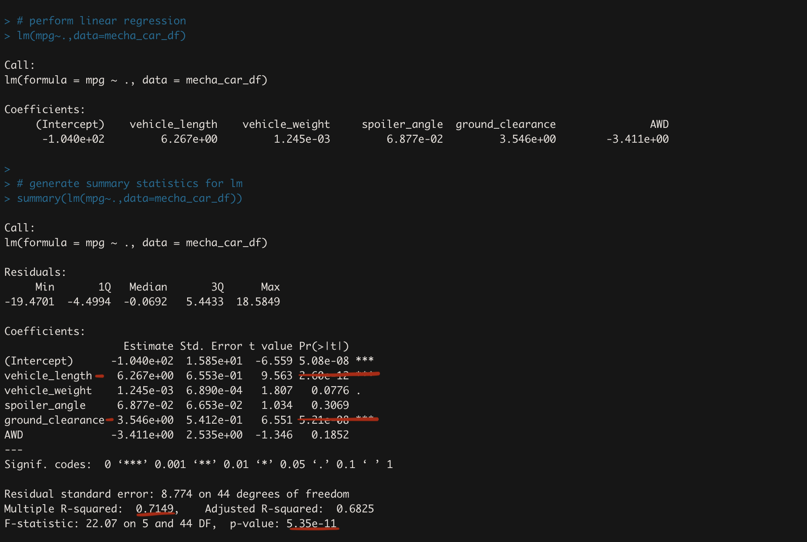

# MechaCar_Statistical_Analysis

## Linear Regression to Predict MPG

Based on the individual Pr(>|t|) values, the variables that were less than 0.05 were for the intercept,vehicle length and ground clearance. This means that the intercept, vehicle length and ground clearance are statistically unlikely to provide random amounts of variance to the linear model, or that vehicle length and ground clearance have a significant impact on mpg. Since the intercept is significant, it means that there is a significant amount of variability in the dependent variable when all independent variables are equal to zero, and we may need to scale or transform the data.

The calculated r-squared value is 0.7149, and therefore shows a strong correlation. This means that our model sufficiently predicts our dependent varaible. 

The p-value is 5.35e-11, which is much smaller than our assumed significance level of 0.05. We can therefore state that there is sufficient evidence to reject our null hypothesis, which means that the slope of our model is not zero.

Based on our calculations, this linear model does predict mpg of MechaCar prototypes effectively. Our r-squared value showed a strong correlation, and our p-value showed significance. In addition, the intercept, vehicle length and ground clearnace all provided a non-random amount of variance to the mpg values in the dataset. For these reasons we can say that our linear model effectively predicts mpg.

## Summary Statistics on Suspension Coils

