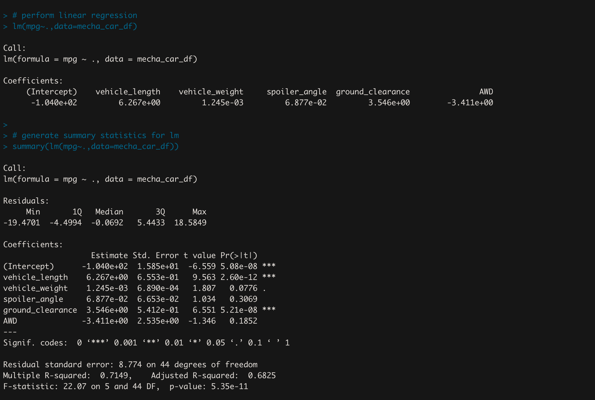

# MechaCar_Statistical_Analysis

## Overview of Analysis

AutosRUs just released a new car, the MechaCar, are they are having troubles with production. They need help finding some insight on their issues. We need to discover which variables predict the MPG for vehicle prototypes, collect summary statistics on PSI for suspension coils, determine if the population mean is statistically different from all lots and each individual lot, and design our own study to compare the MechaCar performance against cars from other manufacturers.

## Linear Regression to Predict MPG

Based on the individual Pr(>|t|) values, the variables that were less than 0.05 were for the intercept, vehicle length and ground clearance. This means that the intercept, vehicle length and ground clearance are statistically unlikely to provide random amounts of variance to the linear model, or that vehicle length and ground clearance have a significant impact on mpg. Since the intercept is significant, it means that there is a significant amount of variability in the dependent variable when all independent variables are equal to zero, and we may need to scale or transform the data.

The calculated r-squared value is 0.7149, and therefore shows a strong correlation. This means that our model sufficiently predicts our dependent varaible. 

The p-value is 5.35e-11, which is much smaller than our assumed significance level of 0.05. We can therefore state that there is sufficient evidence to reject our null hypothesis, which means that the slope of our model is not zero.

Based on our calculations, this linear model does predict mpg of MechaCar prototypes effectively. Our r-squared value showed a strong correlation, and our p-value showed significance. In addition, the intercept, vehicle length and ground clearnace all provided a non-random amount of variance to the mpg values in the dataset. For these reasons we can say that our linear model effectively predicts mpg.

## Summary Statistics on Suspension Coils

In order to determine whether the current manufacturing data meets specific design specifications, I made two dataframes to show 1: the mean, median, variance, and sd for all lots combined and 2: the mean, median, variance, and sd for each individual lot.

The design specifications for the MechaCar suspension coils dictate that the variance of the coils must not exceed 100 PSI, and based on our tables we can see that, as a total, the lots do not exceed 100 PSI. They average 62.3 for the variance. However, if we break down the data into individual lots, we can see that lots 1 and 2 are within the limits, but lot 3 exceeds the 100 PSI variance limit.

## T-Tests on Suspension Coils

I wrote four RSripts using the t.test() function to determine if the population mean of 1,500 PSI was statistically different from the PSI across all lots and each individual lot. 

All lots:

The p-value for all lots was 0.0603, which is not lower than 0.05, and therefore is not low enough for us to reject the null hypothesis. The mean PSI of all lots is not statistically different from the population mean.

Lot 1:

The p-value for lot 1 was equal to 1, which is not low enough for us to reject the null hypothesis. The t-test shows that lot 1 is not statistically different from the population mean.

Lot 2:

The p-value for lot 2 was 0.6072, which is not lower than 0.05 and not enough for us to reject the null hypothesis. The t-test shows that lot 2 is not statistically different from the population mean.

Lot 3:

The p-value for lot 3 was 0.04168, which is barely lower than 0.05, and is enough for us to reject the null hypothesis. The t-test shows that lot 3 is slightly statistically different from the population mean.

## Study Design: MechaCar vs Competition

For the last part of our analysis, we need to describe a statistical study that can quantify how the MechaCar performs against the competition. There are many features people are interested in when it comes to buying a car. One important feature people pay attention to is fuel efficiency in a city vs on the highway. The null hypothesis for our test is that all cars in the same class have the same fuel efficiency, and the alternative hypothesis is that they do not all have the same efficiencies. We can use a ANOVA test to compare sample sizes from different cars models across difference companies. We need fuel efficiency ratings from a sample of cars for each model to accurately test the comparisons between models. If the p-value is greater than 0.05, then MechaCar has the same or similar performance compared to other companies. If the p-value is less than 0.05, then MechaCar is significantly different from the other companies.